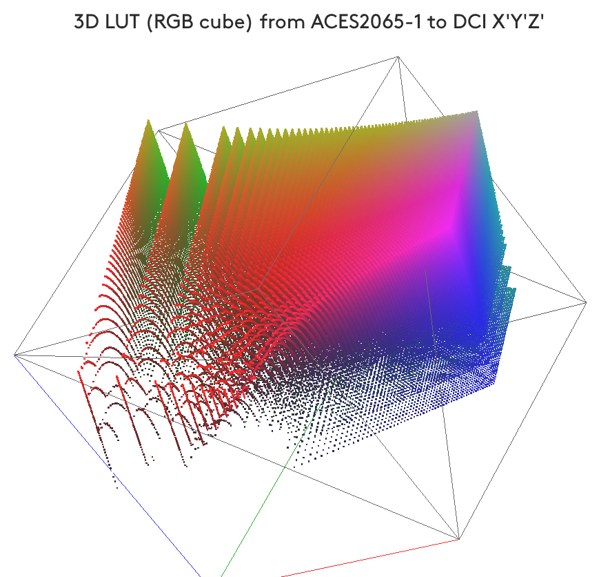

# 3dLUT2js 
__Awesome 3D browsable ColoLUT viewer within a web browser__
Inspired by the __[awesome](https://github.com/sindresorhus/awesome)__ list. Please read the __[contribution guidelines](contributing.md)__ before contributing.

3D ColorLUT converter from one particular LUT format (Digital Vision *Nucoda* **CMS** format) to JavaScript multi-array for integration in WebGL based applications (e.g. 3D LUT cube visualisation).

## Description
The Python script converts either a single 3D LUT or all the LUTs in a given source folder, into a JavaScript multi-array(s) that can be embedded in XHTML or HTML5 code. This code uses WebGL primitives to be visualized, from within a JavaScript-enabled web browser, as a rotating RGB cube" *point-cloud* representing the 3D color transformation, that can be further navigated, zommed and rotated using WebGL mouse-driven commands.
When this code was originally written (circa 2009), such ColorLUT visual-inspection capabilities were only possible via professional, commercial and, mostly, expensive software dedicated to advanced motion-picture industry imaging science. ***3dLUT2js***, instead, makes such previz possible on your computer's web browser, using the [WebGL](https://github.com/mrdoob/three.js) library.

The sample files provide a simple WebGL 3D cube visualizer for navigating within the *RGB cube* representing the 3D LUT: each colour dot in the cube represents the position of target color (with respect to a regular-mesh cube that is the source RGB cube). The dot's colour is the original colour's hue.

Currently, the only supported 3D LUT format is Digital Vision *Nucoda*'s **C**olor **M**anagement **S**ystem (CMS; `.cms` file extension), which is a rather generic format. Both open source and cheap commercial tools are available to convert other ColorLUT formats into the CMS format.

In order to view the examples on your JavaScript/WebGL enabled browser, please make sure to have the `three.js` folder in the same path as the HTML files themselves. `three.js` can be retrieved at https://github.com/mrdoob/three.js

